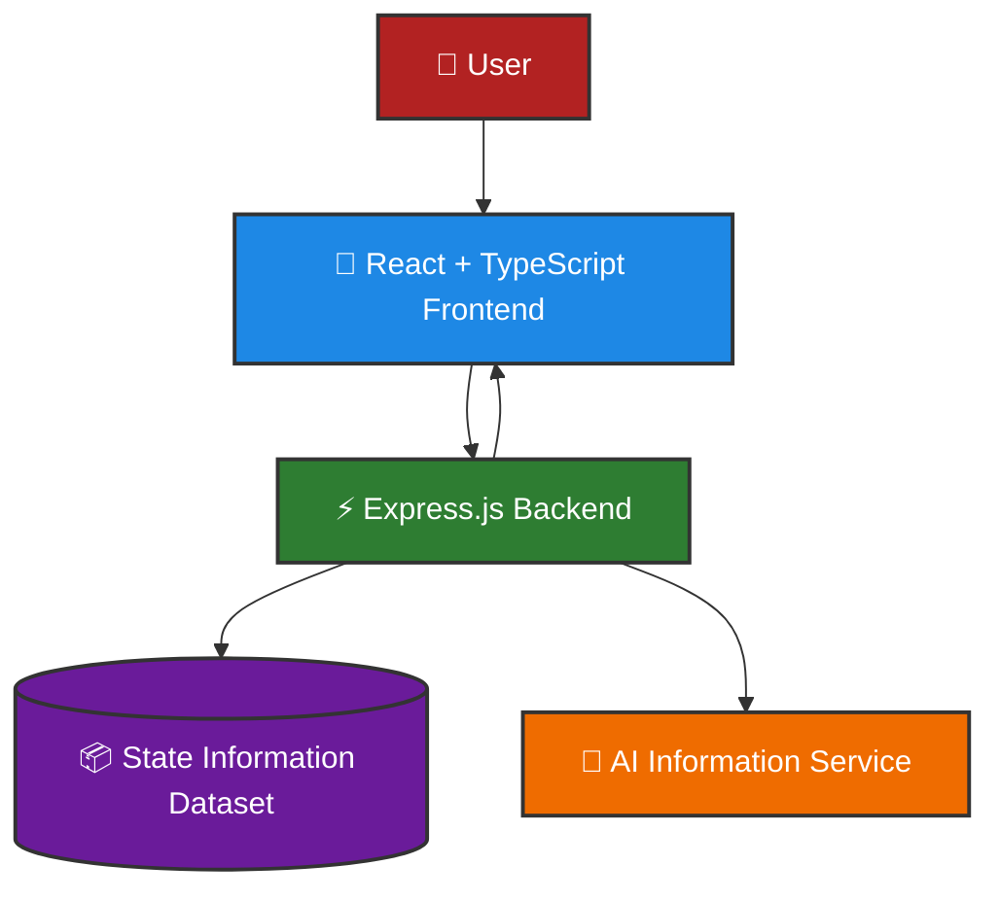
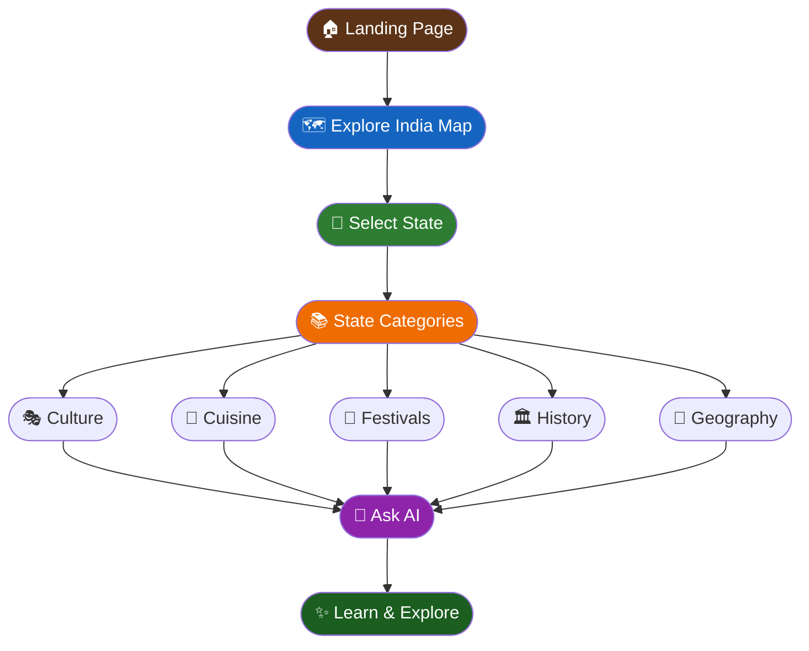

<div align="center">

# ReetiVerse

#### *Journey Through India's Culture, One State at a Time 🇮🇳*

> *Discover the traditions, festivals, cuisines, languages, and stories that make every Indian state beautifully unique.*

<br/>

[](https://react.dev/)
[](https://typescriptlang.org/)
[](https://vitejs.dev/)
[](https://nodejs.org/)
[](https://expressjs.com/)
[](https://vercel.com/)
[](https://render.com/)

<br/>

[](https://reeti-verse.vercel.app/)
[](https://reetiverse.onrender.com/)

</div>

---

# 🌐 Live Deployment

| 🔗 Resource | 🌍 URL |
|------------|---------|
| 🎨 Frontend | https://reeti-verse.vercel.app/ |
| ⚡ Backend API | https://reetiverse.onrender.com/ |

> ⚠️ **Note:** The backend is deployed on Render's free tier and may take a few seconds to wake up after inactivity.

---

# 📸 Screenshots

### 🏠 Landing Page


### 🗺️ Interactive India Map


### 📚 State Information Page


### 🤖 AI Assistant


---

# ❓ Problem Statement

India is home to an extraordinary diversity of cultures, traditions, languages, cuisines, and festivals. However, information about these cultural treasures is often scattered across different sources and presented in a way that feels overwhelming.

**ReetiVerse** aims to become a single digital destination where anyone can explore, understand, and appreciate the unique identity of every Indian state through an interactive and visually engaging experience.

---

# ✨ Features

### 🗺️ Interactive India Map
- Explore every Indian state visually
- Clickable state navigation
- Immersive and intuitive UI

### 📚 Detailed Cultural Information
Discover information about:

- 🎭 Culture & Traditions
- 🎉 Festivals & Celebrations
- 🍛 Food & Cuisine
- 👗 Traditional Clothing
- 🗣️ Languages
- 🏛️ Historical Significance
- 🌄 Geography
- 📍 Tourist Attractions
- 💡 Interesting Facts

### 🤖 AI-Powered Learning
- Ask questions about any state
- Simplified explanations
- Conversational exploration of Indian heritage

### 🎨 User Experience
- Responsive Design
- Smooth Animations
- Scrollable Information Pages
- Modern UI
- Mobile Friendly

---

# ⚙️ Tech Stack

| Layer | Technology |
|-------|------------|
| 🎨 Frontend | React, TypeScript, Vite |
| ⚡ Backend | Node.js, Express.js |
| 📦 Data | JSON-based State Dataset |
| 🚀 Deployment | Vercel & Render |

---

# 🏗️ Architecture



---

# 🌍 User Journey



---

# 📂 Folder Structure

```bash
ReetiVerse/
│
├── 🎨 frontend/
│   ├── src/
│   │   ├── components/
│   │   ├── pages/
│   │   ├── data/
│   │   ├── App.tsx
│   │   └── main.tsx
│   │
│   ├── public/
│   └── package.json
│
├── ⚡ backend/
│   ├── data/
│   │   └── statesData.json
│   ├── routes/
│   ├── server.js
│   └── package.json
│
└── README.md
```

---

# 🚀 Installation

## Clone Repository

```bash
git clone https://github.com/YOUR_USERNAME/ReetiVerse.git
cd ReetiVerse
```

---

## Frontend Setup

```bash
cd frontend
npm install
npm run dev
```

Runs on:

```bash
http://localhost:5173
```

---

## Backend Setup

```bash
cd backend
npm install
npm start
```

Runs on:

```bash
http://localhost:5000
```

---

# 🔑 Environment Variables

### Backend (.env)

```env
PORT=5000
```

### Frontend (.env)

```env
VITE_API_URL=https://reetiverse.onrender.com
```

---

# 📊 Project Highlights

| Feature | Status |
|---------|---------|
| 🗺️ Interactive State Map | ✅ |
| 📚 Detailed State Information | ✅ |
| 🤖 AI-Powered Exploration | ✅ |
| 📱 Responsive Design | ✅ |
| ⚡ Fast Navigation | ✅ |
| 🚀 Cloud Deployment | ✅ |

---

# 🔮 Future Enhancements

- 🌐 Support for regional languages
- ❤️ Save favourite states
- 🔍 Advanced search functionality
- 🧠 Personalized recommendations
- 📖 Cultural quizzes and games
- 🎙️ Voice-assisted exploration
- 📱 Progressive Web App (PWA)

---

# 🤝 Contributing

Contributions are always welcome!

```bash
# Fork the repository
# Create a feature branch
git checkout -b feature-name

# Commit changes
git commit -m "Add feature"

# Push branch
git push origin feature-name
```

Then create a Pull Request 🚀

---

# 👩‍💻 Developer

**Dhruvi Mishra**

- 🐙 GitHub: https://github.com/dhruvim-03
- 💼 LinkedIn: https://www.linkedin.com/in/dhruvi-mishra-a86115288

---

<div align="center">

## 🇮🇳 Celebrating the Cultural Diversity of India

**Made with ❤️ by Dhruvi**

⭐ If you enjoyed this project, consider giving it a star!

</div>
